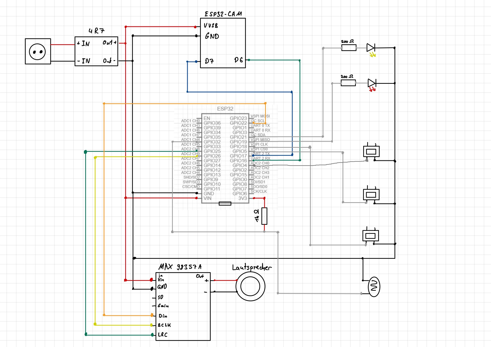

# Physical Computing Lab - Groupe 3

A microelectronics project with an ESP32 about a refrigerator sensor that can detect if the refrigerator has been left open for too long and critically assesses consumer behavior with AI.

### Wiki Link: https://wiki.hci.uni-hannover.de/doku.php?id=teaching:s25:pcl:g3

### Installation Instructions:
1. Host your own Text-to-Speech (TTS) and Barcode Scan server. You can use the provided stuff in the 'fridge_server' folder. A GET on /tts?text=<text> sends an api call to the tts api from chatgpt and streams the received audio back to the ESP32.
A Post on /scan with a JSON body containing the image data will return a JSON with the barcode and the product name (Our ESP32 did not have enough memory to store an image with a proper resolution for scanning for a barcode. That's why we don't actually use the barcode scanner currently).

2. You need to copy the '.env.template' file to '.env' and fill in your API Key.
3. Copy 'secrets.h.template' to 'secrets.h' and fill in your credentials and stuff.
4. If needed, change some other header variables
5. Upload the main code to your ESP32 und the cam code to your ESP32-S3-CAM.
6. Hopefully everything works.

### Features:
- Detects if the fridge is left open for too long
- Buttons for inserting a product, removing a product, and getting the current fridge inventory
- Red Status LED: Lights up when the light sensor detects that the fridge is open. Blinks if an error was detected after an action, e.g. if a product could not be recognized.
- Yellow Status LED: Lights up when an action is being performed, e.g. when a product is being added or removed. While the LED is on, no other actions can be performed.
- The camera can be used to take an image of the product.
- The speaker gives audio feedback on actions, e.g. when a product is added or removed.

### Circuit Diagram:

### URL to the ESP32-S3-CAM Code:
https://github.com/heeeeeenerika/pcl-camera-module
